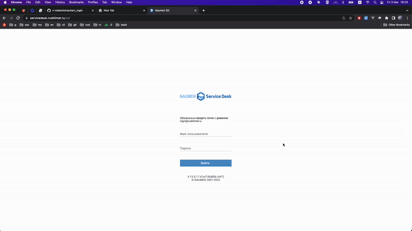

# Naumen login

This script will help you to login at <https://servicedesk.rusklimat.ru/> in two clicks.

NOTE: only for macOS

## Demo

## Installation

1. Open `login_details.yml` file
2. Fill in the user `email` and `password` fields
3. Open `naumen_login` directory in terminal
4. run `sh install.sh`

This will compile and run `naumen_login` binary file.
You can move and run this file from any directory.

if you move the `naumen_login` project you will need to run the install.sh script once again to update paths.
